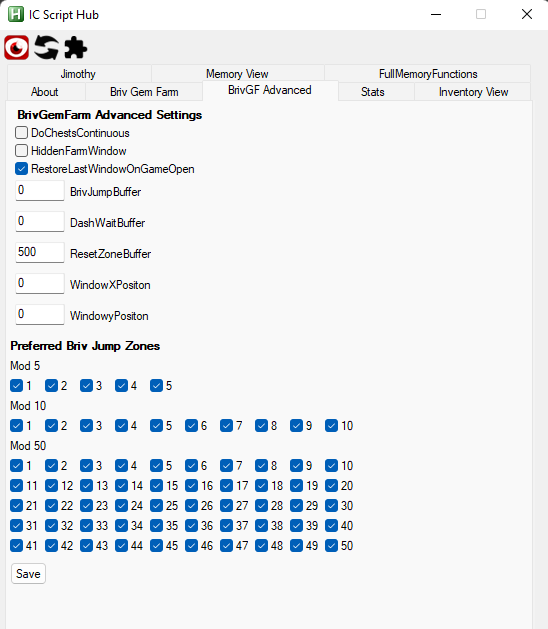
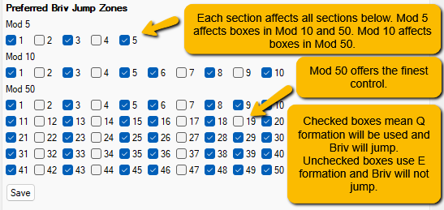

[< Return to Setting Up a Gem Farm](setting-up-a-gem-farm.md)

# Gem Farm: Advanced settings

This iteration of the Gem Farm script attempts to automate a lot of the settings away where possible.

Previously you had to set the specific F keys you wanted the script to hit. It now detects that automatically from the Modron core formation.

The settings file that is saved when you edit the entries using the GUI can be found at [\AddOns\IC_BrivGemFarm_Performance\BrivGemFarmSettings.json](../AddOns/IC_BrivGemFarm_Performance/BrivGemFarmSettings.json)

``NEW`` There is now an advanced settings addon to modify these settings in the GUI. Just enabled BrivGemFarm Advanced Settings.

## "DoChestsContinuous"

By default, the script buys or opens a maximum of 99 chests during stack restart. Enabling this setting will tell the script to Buy or Open as many as it can within the sleep time. It will loop doing 99 of each ``Buy Silver -> Buy Gold -> Open Silver -> Open Gold -> Repeat``. Note that opening chests expects to take several seconds (Silver 3s, Gold 7s) and if the script does not have that much time left, but does have remaining time, it will skip the ``Open Gold/Silver`` steps above.

## "HiddenFarmWindow"

This can be enabled or disabled. When Enabled IC Script Hub will hide the window that appears when you click the Start Gem Farm button on the GUI.

## "RestoreLastWindowOnGameOpen"

This setting will tell the script to try and switch back from the game window to whatever window was open before the game window opened after a stack restart. 

## "ForceOfflineGemThreshold" (Not shown)
The gem farm script is designed to restart the game each run to build stacks for Briv and to keep game performance optimal. This setting allows the the briv stack restart to be postponed until the number of gems reaches what is set here.

## "ForceOfflineRunThreshold" (Not shown)
Same as the above but will do the stack restart once the number of modron resets (runs) reaches the set value. 

## "BrivJumpBuffer"

Occasionally, depending on game build, there can be issues with how the game handles Modron Resets if Briv jumps over the reset zone. This setting is how far before the modron's reset zone Briv will no longer be allowed in the party.

## "DashWaitBuffer"

This is how far before the modron's reset zone the script will no longer attempt to wait for Shandie's Dash to activate. This allows you to effectively disable dash waiting after a stack restart. For more fine tuned control of dash wait, try the ``Shandie Dash Wait after Stacking`` link found on the [Addons page](../Addons.md).

## "ResetZoneBuffer"

This is how far past your Modron Core reset point the game will allow you to travel before the game resets for you

This is useful for running a Gem Farm in a variant where the Modron core will not reset for you. This is a very niche situation though.

You will also need to modify this if you early stack to maximise how many steelbones stacks you get. The value needs to be greater than the difference between your Modron reset area and your stack area.

## "WindowXPosition" and "WindowYPosition"

These set the X and Y coordinates for the Gem Farm window. To move the game window try the ``Move Game Window`` addon on the [Addons page](../Addons.md).

## "Preferred Briv Jump Zones"

Each mission cycles through 50 zones. This setting allows you to choose which of those zones you want to use 'q' (checked) formation on and which you want to use 'e' (unchecked) formation on. This allows you to fine tune when Briv jumps. 

Some examples:  
- Disabling all zones ending in 5 or 0 will ensure 4/9j Briv will return to skipping bosses after defeating a boss if they erronously land on one. Do this by clicking on the 5 checkbox in the Mod 5 area.
- Skipping specific zones that have troublesome enemies/bosses (e.g. armored/hit based) can be done by unchecking zones that are at that zone-(jump level + 1). (e.g. to avoid landing on 50 with 7j Briv, you would uncheck 50-(7+1)=42).