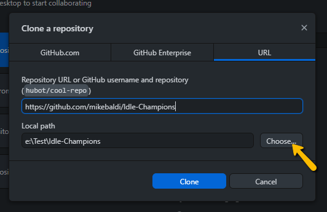
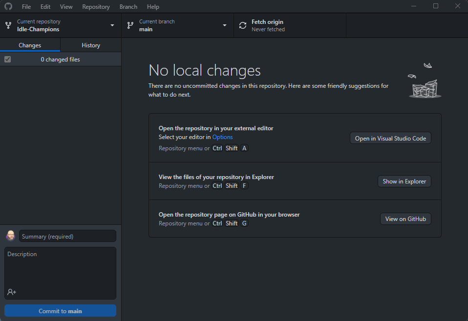
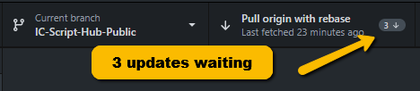

[< Return to the Readme](../Readme.md)

# Getting started with IC Script Hub using Git
## Introduction

Git is a software development tool that allows for mass collaboration on a single repository of code.

Most people reading this won't be modifying the code, so this guide will only cover getting GitHub Desktop for Windows installed, cloning the repository, and pulling any updates.

It may look like a lot to do to get started but, once done, all you need to do to remain up to date is click a button.

## What we'll cover

* Creating your GitHub account
* Installing GitHub Desktop for Windows
* Creating a local clone of the IC Script Hub repository
* Pulling updates from the repository

## Creating your GitHub account

[Sign up for a free GitHub account](https://github.com/signup)

## Installing GitHub Desktop for Windows

[Download and install GitHub Desktop](https://desktop.github.com/).

Log in using the credentials you created in the previous step once you have installed GitHub Desktop.

## Creating a local clone of the IC Script Hub repository

[Navigate to the code repository for `IC Script Hub` in a browser](https://github.com/mikebaldi/Idle-Champions/tree/main) and then click the green Code button. Pick `Open with GitHub Desktop`.

A dialog box will pop up. Click the `Choose...` button to pick the folder where the repository will be cloned into.

Click `Clone` and wait for the cloning process to complete.

You'll see this:

A box may appear inviting you to create a Pull request. Ignore this if it shows up.

Click the `Fetch Origin` button that is to the right of Current branch.

You now have the latest version of `IC Script Hub` on your local machine.

## Pulling updates from the repository

That leaves one last bit to cover before diving into using the scripts within `IC Script Hub`: staying up to date.

Simply click on the `Fetch origin` button when it tells you there is an update to pull. You don't need to stay on top of every update there is. 

I'll be honest here: You're only really going to update when you read about a new feature or bug fix you like the look of in the Scripting channel on the Idle Champions Discord.

That's perfectly okay. 

Don't feel the need to stay on top of updates, especially if it is working fine for you.

Just take a look if you run into an issue, and every now and then in case of new functionality/speed optimisations.

## What's next?

Now you're going to want to launch `IC Script Hub` for the first time and set up your game location.

Where do you play the game?

[I play on Steam](using-ic-script-hub-with-steam.md) 

[I play on EGS](using-ic-script-hub-with-egs.md)