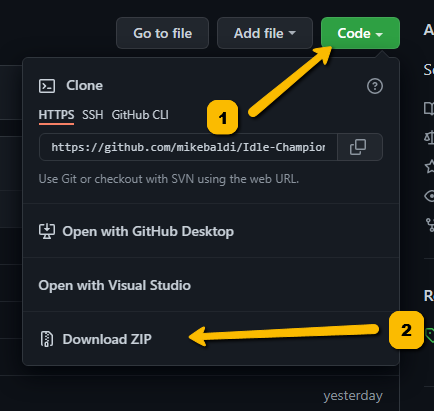

[< Return to the Readme](../Readme.md)

# Getting started with IC Script Hub using Zip
## What we'll cover

> ⚠️ It is not recommended that you use IC Script Hub via this method. It is only added here for completion. [The recommended method is to use Github Desktop or another Git client](getting-started-with-ic-script-hub-using-git.md) ⚠️

* Downloading the Zip file
* Unzipping the Zip file to your local machine
* Getting updates from the repository

## Downloading the Zip file

[Navigate to the code repository for `IC Script Hub` in a browser](https://github.com/mikebaldi/Idle-Champions/tree/main) and then click the green Code button. Pick `Download ZIP`.

## Unzipping the Zip file to your local machine

Use your preferred method of extracting zip files to get all the files into a folder on your machine.

At minimum you can double click the downloaded file, click the `Extract all` button in Windows Explorer, and then pick a location to extract it.

## Getting updates from the repository

To get updates, you'll need to do the previous two steps every time a change is made that you want in your version. 

Remember to use the same location.

Sometimes there will be multiple updates a day. 

It's **strongly** recommended that you check out the process for [Getting started with IC Script Hub using Git](getting-started-with-ic-script-hub-using-git.md) because updating is so much quicker that way.

## What's next?

Now you're going to want to launch `IC Script Hub` for the first time and set up your game location.

Where do you play the game?

[I play on Steam](using-ic-script-hub-with-steam.md) 

[I play on EGS](using-ic-script-hub-with-egs.md)