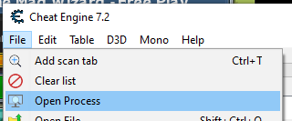
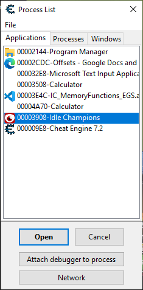
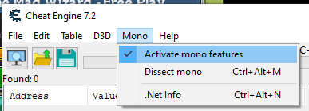
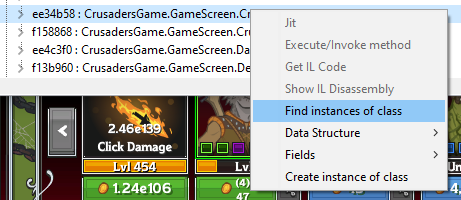
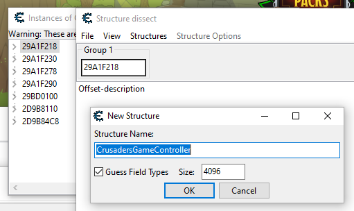
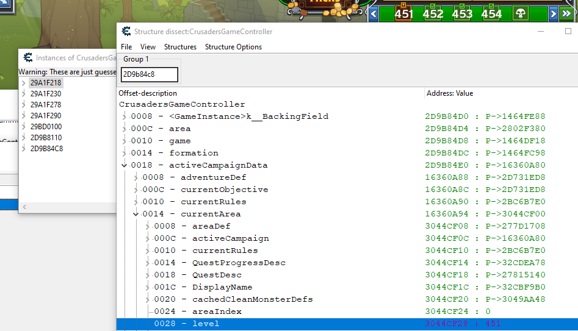
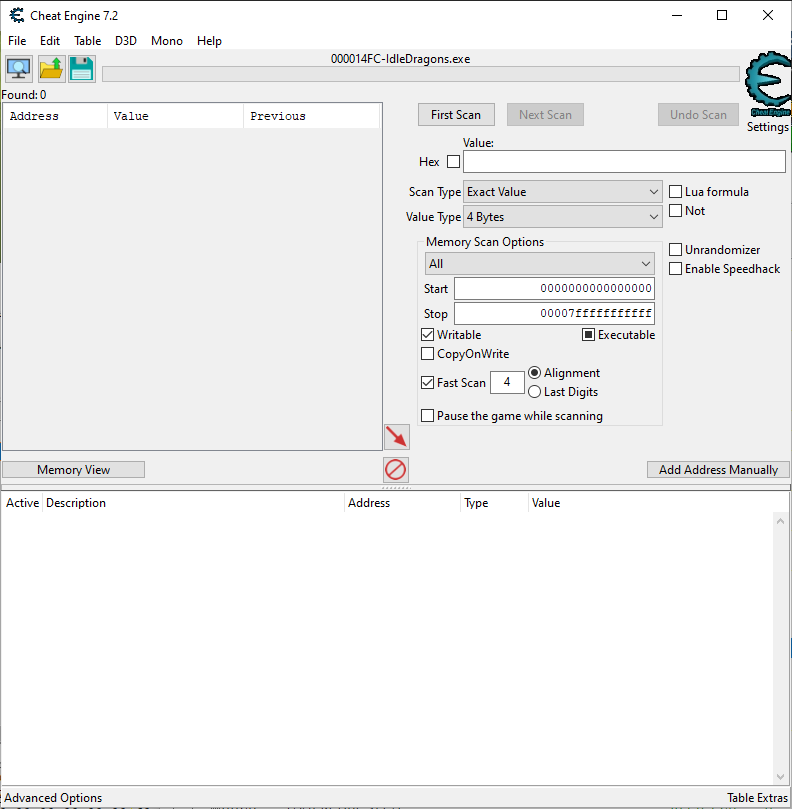
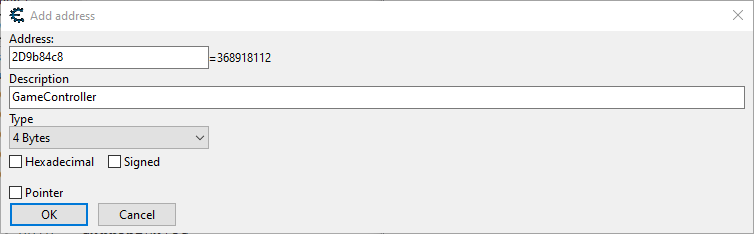
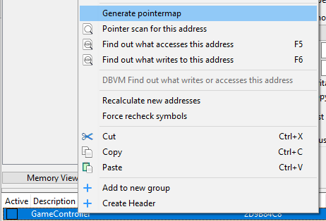

## A Quick Run Down Of Finding Idle Champions Pointers With Cheat Engine

Static pointers work a little differently. More information is in the [GameSettingsStaticInstructions.pdf](../GameSettingsStaticInstructions.pdf).

1. Restart your computer.

2. Open Idle Champions and Cheat Engine 3.

3. Open the Idle Champions Process

   

   

4. Activate Mono Features (should be checked as in image)

   

   Tip: disable mono features before closing the opened process.

5. Dissect mono (Ctrl+Alt+M)

6. Expand tree and select Assembly-CSharp

7. Find (Ctrl+F) gamecontroller

   Tip: Uncheck `Search entire file`

8. Find Next until you find CrusadersGame.GameScreen.CrusadersGameController Class

    

9. Right click and select find instances of class

    

10. Double click any of the addresses in the Instances of... window that pops up to open the Memory Viewer

11. Open the Structure dissect window (Ctrl+D)

12. Enter an address from the Instances of... window in the field for Group 1.

13. Define a New Structure (Ctrl+N)

    

    If the Structure Name is not consistent with the class, press cancel and try a new adress from the list.

14. Check if the structure is correct.

    

15. Add Address Manually (center left button), include a description.

    

    

16. Right click the added address and select Generate pointermap and save the map.

    

17. Repeat steps 1 through 16 to generate a second pointer map.

18. Close Idle Champions.

19. Right click the second (or any) address and select pointer scan for this address

    

20. Check the Use saved pointermap box and select the first map you generated.

21. Use the pull down to select the correct address.

22. Check the Compare results with other saved pointermap(s) box.

23. Select a file and choose the second map you generated.

24. Use the pull down to select the correct address.

25. I generally start with these settings:

    

26. Restart Idle Champions, find the correct address for the Game Controller structure. You can use the steps above or look at the Pointer Scan results and start with an address you see there to skip using the mono dissector and instance scan.

27. Repeat step 26 until you have a handful of paths. If the number remains large and unchanging, consider restarting your PC, swapping parties back and forward in Idle Champions, restarting your adventure, etc. If you are left with no pointer paths you may need to change Max level setting in step 25 to a number higher than 7.

28. With a solid pointer to the structure we can then go back to our Structure dissect window and retrieve the remaining offsets to the actual memory locations we are interested in.

    

    This structure has a module base address of "mono-2.0-bdwgc.dll"+003A0574 and offsets of 0x658, 0xA0, 0x28, 0x8, and 0x0. For our purposes with AHK the 0x0 can be omitted from our scripts.

    The Structure dissect window lists the offsets on the left side. We see an offset of 18 to get to activeCampaignData, an offset of 14 to get to currentArea, and an offset of 28 to get to level. If this is the only read we want from this structure your offset array to level would look like: [0x658, 0xA0, 0x28, 0x8, 0x18, 0x14, 0x28]

    If we were planning on reading multiple locations in memory based on this structure we could code AHK to read the our pointer to the structure which gives us the address of the structure, store that as a variable to be used as a base address for the subsequent reads with the offsets garnered from the Structure dissect window. In this example it would save four memory reads per any memory read after level. As of drafting these instructions, the script is reading Quest Remaining, Is Transitioning, and Time Scale Multiplier from this structure, saving us 12 memory reads per cycle.