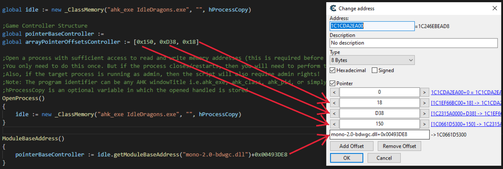
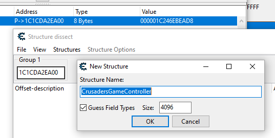
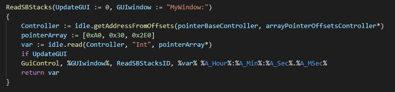
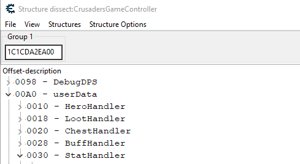
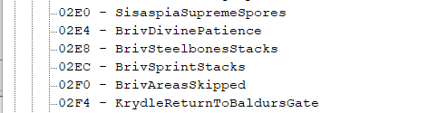
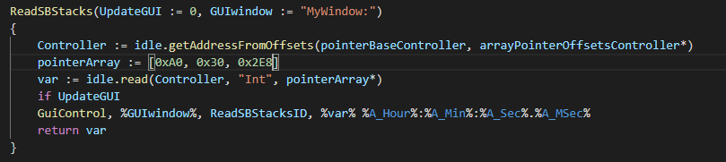

## How To Update Memory Read Offsets Using Cheat Engine
`Outdated`  Please see [imports](..\Readme.md#imports) to update offsets.

With the method laid out below we will use Cheat Engine and a working pointer to the CrusadersGameController structure to find new offsets for memory reads that are no longer working correctly, due to the structures shifting offsets. If every memory read is no longer working, then the following method may not work as that would be a sign that the pointer to CrusadersGameController is no longer good.

1. Open Idle Champions and Cheat Engine

2. Open the Idle Champions Process

   

   

3. Activate Mono Features (should be checked as in image)

   

   Tip: disable mono features before closing the opened process.

4. Click 'Add Address Manually' and input the Game Controller pointer information. Make sure to add an extra zero offset and set type to 8 byte.

   

5. Save this pointer (Ctrl+S) to skip step 4 the next time offsets change.

6. With the added address highlighted, open the Memory Viewer (Ctrl+B)

7. Open the Structure dissect window (Ctrl+D)

8. Confirm the address of the pointer and 'Group 1' field of the Structure dissect window are the same and define a New Structure (Ctrl+N).

   

   If the Structure Name is not CrusadersGameController then you may have a bad pointer or Mono features may not be activated.

9. In the memory functions AHK file find the function for the memory read that is not returning a correct value, for this example:

   

10. Browse to the old location by using the offsets in the array defined as pointerArray. In this example: A0, 30, and 2E0.

    

    

    Notice offset 2E0 now corresponds to a field labeled SisaspiaSupremeSpores, however, 8 bytes down with an offset of 2E8 is BrivSteelbonesStacks.

11. Update the final offset in the array defined as pointerArray to 0x2E8

    

12. Repeat steps 10 through 12 as necessary