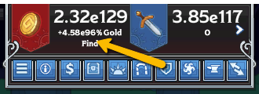
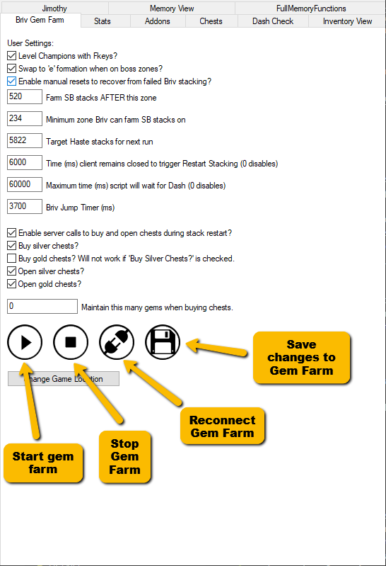

[< Return to an Introduction to IC Script Hub](an-introduction-to-ic-script-hub.md)

# Setting up a Gem Farm
## Introduction

Gem Farms are the quickest way to increase the power of your champions.

They are also finicky beasts and what works for one person may not work for another, even if the exact same settings and champions are used.

You need to be willing to experiment with your own roster and PC. The rewards will be worth it.

## Prerequisites

* You need `Briv`. Any skip level will do and the higher level your Briv is the more rewarding your gem farm is likely to be (except for 5-skip. Friends don't let friends 5-skip Briv).

## Intro to setting up your formations

The core of the automated Gem Farm script is that you have three formations set up and mapped to the 1, 2, and 3 starred formation slots in game (which map to the keybinds Q, W, and E).

### Formation 1

Formation 1, bound to Q, will contain your main speed team. At minimum this will contain `Briv`. Many champions have beneficial aspects to them, and some are explored in a [Gem Farmer's Guide to Champions](gem-farmers-guide-champions.md).

Place at least 3 familiars on the field. Click damage is what's going to drive your Gem Farm fowards.

It's recommended that you have a familiar on Click Damage as well.

Your Modron core should also be set to load a formation that contains every champion in your Q formation. If in doubt, set it to your Q formation as well.

### Formation 2

Formation 2, bound to W, will contain your tank team. At minimum this will contain `Briv`. You can also add in health-share champions to this formation. 

Be aware that Gem Farms prosper most when they are right on the edge of success and failure. 

Use only what you need to use.

Remove ALL familiars from the field for this formation. If you're clicking, Briv won't get to tank and you'll wonder why your Gem Farm just keeps restarting.

### Formation 3

Formation 3, bound to E, will contain your Briv-swap team. This should (at minimum) be a copy of your Q team with the exception of `Briv` and `Hew Maan`. 

Use the same familiar setup as your Q formation here.

### General notes on formations

* You do not need to, and should not, fill up the party. More champions means more animation. More animation means a slower screen update. A slower screen update means a slower Gem Farm, which results in fewer gems for you.
* You need to figure out what works best for your PC and your roster. Use this document for advice but experimentation will find what works best for you.

## Configuring your Modron Core

Set your Modron core to the level you wish to restart your farm at. It should (at the very most) be almost exactly what the formula `7.6 x your Gold Find e number` returns.

First ensure your game is in scientific notation by going into the settings (Escape) and checking the box:

Now we can see the e number for our gold find.

Here we can see the gold find is 4.58e96%, so the number we plug into the formula above is 96. 

This gives us 729.6 and so using 730 as a reset would be good enough.

Set the Modron core to your reset point, ensure the formation is set to the same formation as bound to Q (or one that has the same champions in it, see further tips below).

You can also set any potions you wish to use. Potions are an advanced topic and detailed information on them can be found in the Scripting channel on the official Discord.

## Configuring the Gem Farm

It's time to configure the Gem Farm script now that you have your formations and your Modron core set.

Here's a reminder of the Gem Farm setup screen (along with an explanation of what the image buttons do):

The screenshot may differ from what you see as `IC Script Hub` is still in active development.

### Level Champions with Fkeys?

This setting will determine whether F1-F12 are used to rapidly level your champions. It saves you from having to use familiars on your champions.

It also automatically determines which F keys are needed from the formation loaded in the Modron core.

### Swap to 'e' formation when on boss zones? (LEGACY)

>`NEW`: This setting has been removed and replaced with the advanced setting "Preferred Briv Jump Zones" in advanced settings. Disabling Mod5(5) will effectively accomplish the same thing. See "Gem Farm Hidden Settings" below to see where to find the new setting.

### Enable manual resets to recover from failed Briv stacking?

This setting will force an early restart of a run if it determines that you have run out of haste stacks and have enough Steelbones stacks in reserve to complete the next run.

### Farm SB stacks AFTER this zone

This is the zone where you want to stack `Briv` so that he can get the stacks for the next run. 

The number varies dramatically across players' setups for many reasons, including:

* Some adventures will have preferable stack zones
* Some runs will require mid-run stacking in order to be able to live to get enough stacks to reach the end of a run
* Some people will prefer to stack as late as possible to ensure that `Shandie` keeps her Dash for as long as possible

A good rule of thumb to start with is give yourself a buffer to allow Briv to stack and skip a couple of times before resetting (offline stacking is never a guaranteed thing).

For example if you have a Briv that can skip a zone every kill, and sometimes two, you consider that a 2 skip Briv for this purpose.

You're resetting on z100. 2 skip buffer from that would be a stack point of 96.

So your number for this setting would be 95.

### Minimum zone Briv can farm SB stacks on

This is a recovery setting. If a run fails to generate stacks for any reason, your formation is not skipping at all.

This is slow.

So you would need to figure out the lowest possible zone YOUR Briv can gain stacks. 

You just need to experiment for this. It should be a number no greater than your stack number + 1.

Let's assume you're happy in this case to use the same one as your regular stack: Regular stack setting is 95. This setting would be 96, which essentially means it is ignored.

If you worked out that your Briv could get stacks on 51 and above, you would put 51 here.

### Target haste stacks for next run

Calculate this number using [IC Byteglow Utilities](https://ic.byteglow.com/speed/).

Link up your account to get your Briv info automatically (or enter the data into the form on that page), and then put your desired Target Area into the form.

The stacks needed number that is shown next to the box is what you put in the settings field here. 

### Time (ms) client remains closed to trigger Restart Stacking (0 disables)

For now you can leave this at the default.

You will want to increase this number if your Gem Farm struggles to stack Briv reliably.

You can also decrease the number to optimise your Gem Farm. 

This will have side effects in that you may no longer have time to buy or open chests. 

You may also have less reliable offline stacking if you reduce the number too much.

### Enable server calls to buy and open chests during stack restart?

If this is unchecked, none of the boxes below will have any effect.

### Buy silver chests?

The script will buy as many silver chests as it can during Briv's offline stack restart.

### Buy gold chests? Will not work if 'Buy Silver Chests?' is checked

The script will buy as many gold chests as it can during Briv's offline stack restart. It will only have an effect if the previous setting is unchecked.

### Open silver chests?

Opens all unopened Silver chests when set. This does not include any chests bought on the last restart.

It will fail to work if your "Time (ms) client remains closed to trigger Restart Stacking (0 disables)" setting is too low (or set to 0).

### Open gold chests?

Opens all unopened Gold chests when set. This does not include any chests bought on the last restart.

It will fail to work if your "Time (ms) client remains closed to trigger Restart Stacking (0 disables)" setting is too low (or set to 0).

### Maintain this many gems when buying chests

This setting is for you if you are, for example, saving up for a 100,000 gem familiar or just want to maintain a gem buffer.

Just pop the value of the gems you want to save up or keep as a buffer in here.

## Further tips

* If you have opted to use health-share tanks to increase the number of stacks you get for `Briv`: create a copy of your Q formation, add these tanks into there, and set that formation as your Modron core formation. The tanks will get auto levelled in the early zones, but not slow down your run by being in the Q formation.
* Turn off all damage nodes in your Modron core and save it as a new setup. Load this setup as a part of your Gem Farm pre-setup. This allows your Briv to stack earlier, both normally and in recovery situations.

## Gem Farm: Advanced settings

There are a number of settings that are hidden by default. These are available in the Gem Farm Advanced Settings addon, which is included by default. Click the Jigsaw icon, and enable the Gem Farm Advanced addon to see these. [I cover those over here](gem-farm-advanced-settings.md).

[< Return to an Introduction to IC Script Hub](an-introduction-to-ic-script-hub.md)

