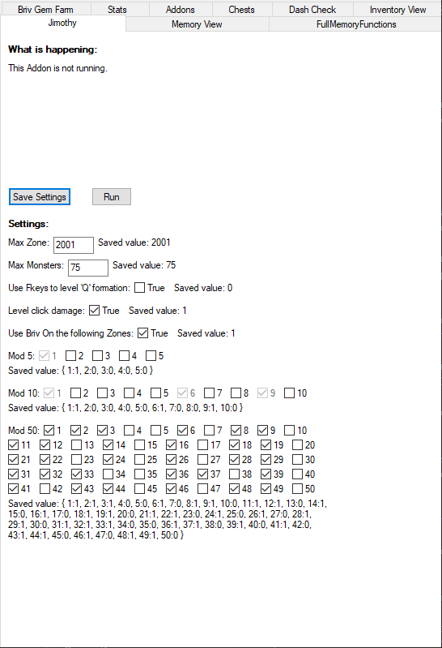

[< Return to an Introduction to IC Script Hub](an-introduction-to-ic-script-hub.md)

# Setting up Jimothy

## Introduction

The Jimothy script within `IC Script Hub` is a way to automate reaching high level zones once you have some very specific champions.

## Prerequisites

It's required that you have at least:
* `Briv` at 100% 1 skip or higher
* `Hew Maan` at 2-3 kill zone completion for the number of adjacencies within the adventure you are running Jimothy in.
* `Jim`

There are more options to fail a zone the more kills Hew requires to complete it. 

Once you reach the instant kill zones (where mobs will instantly kill a champion when they reach them) this can mean the difference between success or failure.

For this reason it is also strongly recommended that you have `Baeloth` as well.

## Setting up your formations

Jimothy uses two formations, bound to Q and E. 

### Setting up the Q formation

This will be your full Jimothy party. It should also be the formation set on your Modron core.

### Setting up the E formation

This will be your Q formation minus `Briv`.

## Setting up your zone behaviour

Let's look at the Jimothy window again:

"Max zone" contains the zone you want to reach.

"Max monsters" is how many you want to allow on screen before you give up, go back a zone, then retry.

"Use Fkeys to level 'Q' formation" should be checked if you aren't using familiars on your bench slots.

"Level click damage" should be set if you aren't using a familiar on your click damage slot.

If you would rather set the zones that you want to bring Briv in for, check "Use Briv on the following Zones" otherwise uncheck it. This is personal preference. 

The boxes you tick past this point will be adventure specific and affected by how much your Briv skips.

If you have a 1 skip only Briv, you'll want to ensure he's not in the formation on any z3 zones (z8, z13 and so on). You'll also want to only use him, perhaps, on z4s if you want to preserve skip stacks.

Once all the values are set, load into your adventure, and click `Save Settings` and then `Run`.

You can also just initiate a Jimothy run from the point where your speed and push teams cap out (but before they get stuck on a boss). I use this method.