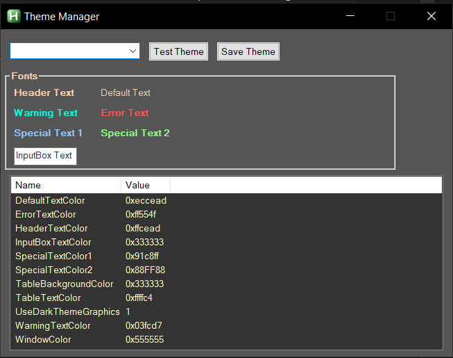
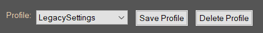

# **Script Hub Updates**  
## **New Theme Manager**  
  
The new Theme Manager addon can be accessed from Briv Gem Farm's tab. It can be used to preview themes and choose which one to use.  
## **New Gem Farm Profiles**  
  
Briv Gem Farm now allows multiple settings profiles to be saved and swapped.  
## **RIP Potato**  
Briv Gem Farm Potato has been removed and its features have been merged into Briv Gem Farm. Multiple other places have had adjustments to reduce overall CPU load as well.  
## **Updated Chest Purchaser**  
  
The Chest Purchaser addon now has filters. Just start typing the name of the chest you are looking for and the list will show only matches.  
## **Title bar "Loading..." until all addons are loaded.**  
  
Title bar now shows "Loading..." until all addons have completed loading.  

&nbsp;
# **Addons**  
Most addons should remain compatible.
## **No Modron Leveling**  
> **WARNING**

Due to some architecturally specific code, No Modron Leveling is not compatible with the update without updates.
## **No Modron Adventuring**  
No modron adventuring has been updated to be compatible with the addon and has had improvements to its functionality (such expecting to fully level with the first gold pickup).  

&nbsp;
# **[For Developers](./update-3-6-0-news-developers.md)**  

