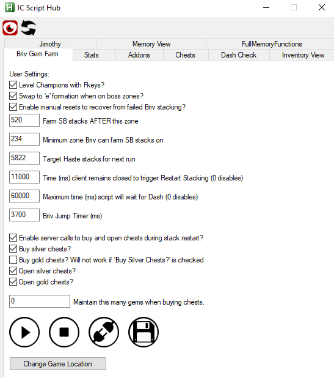

[< Return to the Readme](../Readme.md)

# Setting Idle Champions game location for EGS

## Overview

The scripts inside `IC Script Hub` need to know where your game is installed.

## Opening `IC Script Hub`

Navigate to the folder you cloned the repo into using Windows Explorer. 

You can press `Ctrl+Shift+F` from within GitHub Desktop if you used that to clone the repository.

Double-click on `ICScriptHub.ahk` in the explorer window that opens to launch `IC Script Hub`.

You should see the `IC Script Hub` window and it should look something like this:

You may need to [install or update AutoHotKey](https://www.autohotkey.com/) if you receive an error at this point.

## Setting the EGS game location
### Step 1: Grab the shortcut you need

1. Open the `EGS client`
2. Go to your `Library`
3. Click the three dots underneath the `Idle Champions` game entry in your `Library` and pick `Create a Shortcut`
4. Right click on the shortcut on your Desktop and pick `Properties`
5. Copy the contents of the Url box that appears

### Step 2: Populate the location in `IC Script Hub`

1. Return to your `IC Script Hub` window
2. Click the `Briv Gem Farm` tab
3. Click the `Change Game Location` button at the bottom of the `Briv Gem Farm` window
4. Paste the link copied from the `Idle Champions` shortcut into both boxes
5. Click `Save and Close`

## Now that's done, what can I do with this thing?

[Let's find out.](an-introduction-to-ic-script-hub.md)