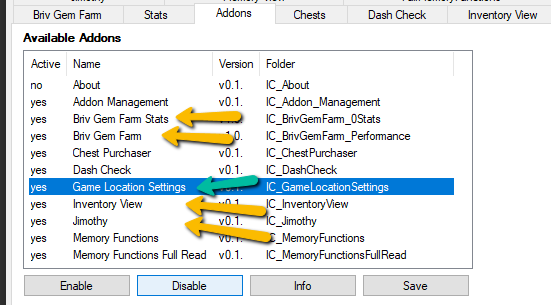
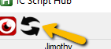

[< Return to the Readme](../Readme.md)

# Setting Idle Champions game location for Standalone

## Overview

The scripts inside `IC Script Hub` need to know where your game is installed.

## Opening `IC Script Hub`

Navigate to the folder you cloned the repo into using Windows Explorer. 

You can press `Ctrl+Shift+F` from within GitHub Desktop if you used that to clone the repository.

Double-click on `ICScriptHub.ahk` in the explorer window that opens to launch `IC Script Hub`.

You should see the `IC Script Hub` window and it should look something like this:

You may need to [install or update AutoHotKey](https://www.autohotkey.com/) if you receive an error at this point.

## Setting the standalone game location
### Step 0: Make sure your addons are enabled

You'll want to make sure you have the game shortcut addon enabled. Click into the addons tab and ensure the addon highlighted by the green arrow is enabled and saved.

I recommend making sure the ones with the yellow arrow are also enabled too.

It should reload your Script Hub for you but should you ever want to do a manual reload (to reset the stats screen for instance, just remember to reconnect to your Gem Farm script if you do this) hit the reload button:

### Step 1: Grab your support URL

1. Start the game
2. Press Escape
3. Click Support
4. Copy the entire URL that is opened in your browser to Notepad or similar
5. Look at the last portion of the Support URL to find your user_id and device_hash.

### Step 2: Grab the shortcut you need

1. Locate your `standalone client`
2. Find `IdleDragons.exe`
3. Create a shortcut for `IdleDragons.exe`
4. Edit the properties for the shortcut.
5. Copy the entire path including `IdleDragons.exe`
6. Right click on the shortcut on your Desktop and pick `Properties`
7. Edit the Target adding to the end of the URL:
   ` -user_id user_id_from_support_url -hash device_hash_from_support_url` (including the space at the start so it looks like `...IdleDragons.exe -user_id somestuffhere -hash someotherstuffhere`)
8. Test the shortcut
9. If it works, copy the entire contents of the Target box in the shortcut Properties. If not, get it working, and then copy the contents of the Target box.

### Step 3: Populate the location in `IC Script Hub`

1. Return to your `IC Script Hub` window
2. Click the `Briv Gem Farm` tab
3. Click the `Change Game Location` button at the bottom of the `Briv Gem Farm` window
4. Paste the link copied from the `Idle Champions` shortcut into the top box and blank out the bottom box.
5. Click `Save and Close`

## Now that's done, what can I do with this thing?

[Let's find out.](an-introduction-to-ic-script-hub.md)